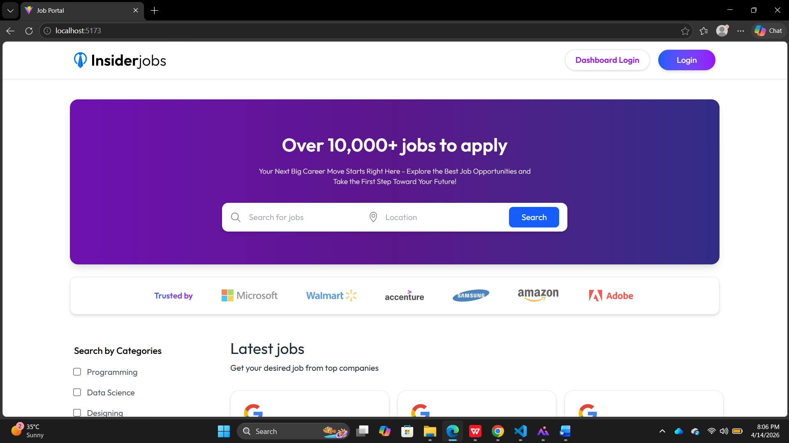
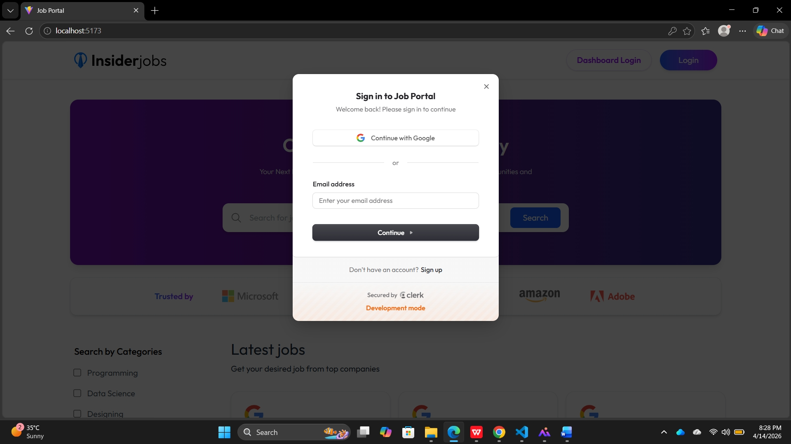
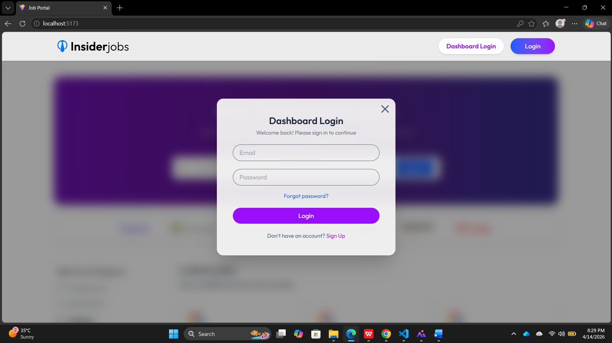
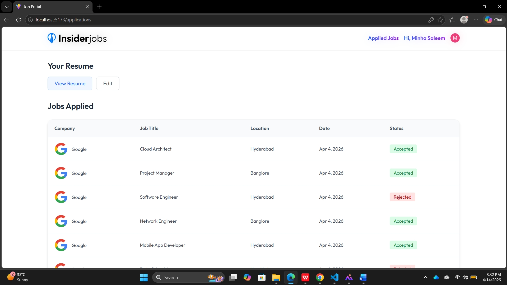
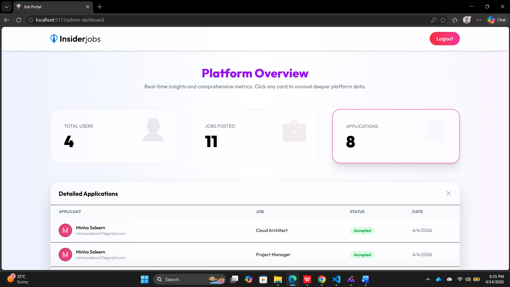
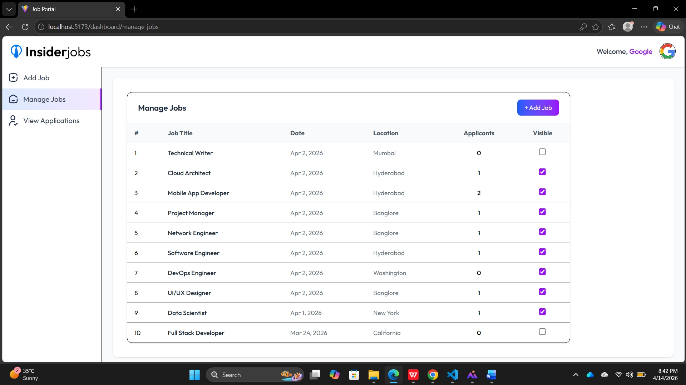
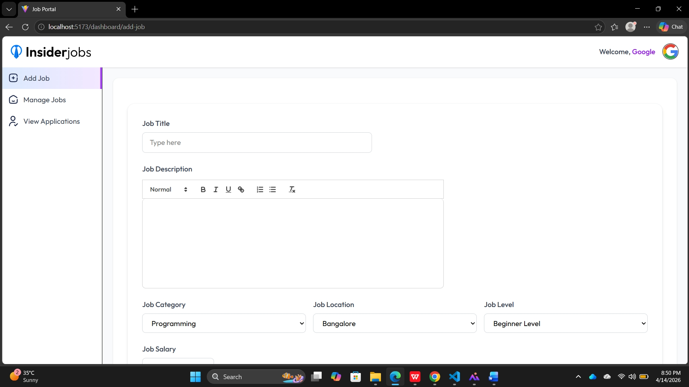
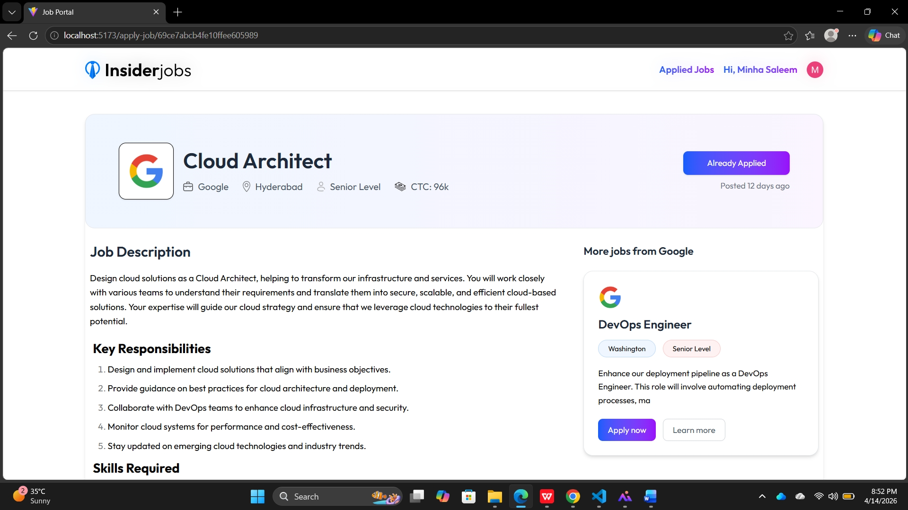

<p align="center">
  
  
  
  
  
</p>

<h1 align="center">🏢 InsiderJobs — Job Portal</h1>

<p align="center">
  <b>A full-stack job portal web application connecting job seekers with recruiters.</b><br/>
  Built with the <b>MERN stack</b> (MongoDB, Express, React, Node.js), featuring <b>Clerk</b> authentication for users, a dedicated <b>Recruiter Dashboard</b>, and an <b>Admin Panel</b> with real-time platform analytics.
</p>

<p align="center">
  <a href="#-features">Features</a> •
  <a href="#-tech-stack">Tech Stack</a> •
  <a href="#-screenshots">Screenshots</a> •
  <a href="#-project-structure">Project Structure</a> •
  <a href="#-getting-started">Getting Started</a> •
  <a href="#-api-endpoints">API Endpoints</a> •
  <a href="#-database-schema">Database Schema</a> •
  <a href="#-deployment">Deployment</a>
</p>

---

## ✨ Features

### 👤 Job Seekers
- 🔐 **Authentication** via Clerk (Google OAuth + Email/Password)
- 🔍 **Search & Filter** jobs by title, location, and category
- 📄 **Apply to Jobs** with resume upload (Cloudinary storage)
- 📋 **Track Applications** — view status (Pending / Accepted / Rejected)
- 📝 **Manage Resume** — upload, view, and edit

### 🏢 Recruiters (Company Dashboard)
- 🔑 **Secure Login** with email/password + password reset
- ➕ **Post Jobs** with rich-text descriptions (Quill editor)
- 📊 **Manage Jobs** — toggle visibility, track applicants
- 👁️ **View Applications** — review applicants and update status (Accept/Reject)

### 🛡️ Admin Panel
- 📈 **Platform Overview** — total users, jobs posted, applications
- 📋 **Detailed Metrics** — drill-down into users, jobs, and application data
- 🔐 **Protected Access** via JWT-based admin authentication

### 🌐 General
- 🎨 Responsive, modern UI with TailwindCSS v4
- 🔔 Toast notifications for real-time feedback
- ☁️ Image & resume uploads via Cloudinary
- 📡 Webhook integration (Clerk → MongoDB user sync via Svix)
- 🐛 Error monitoring with Sentry

---

## 🛠 Tech Stack

| Layer          | Technology                                                                 |
|----------------|---------------------------------------------------------------------------|
| **Frontend**   | React 19, React Router v7, Vite 7, TailwindCSS v4, Quill (Rich Text)     |
| **Backend**    | Node.js, Express 5, Mongoose 9                                            |
| **Database**   | MongoDB Atlas                                                              |
| **Auth**       | Clerk (Users) · JWT + Bcrypt (Recruiters/Admin)                            |
| **File Storage** | Cloudinary (images & resumes) · Multer (upload middleware)               |
| **Monitoring** | Sentry (error tracking & profiling)                                        |
| **Webhooks**   | Svix (Clerk webhook verification)                                          |
| **Deployment** | Vercel (both client & server)                                              |

---

## 📸 Screenshots

<details>
<summary><b>🏠 Home Page</b></summary>
<br/>
<p align="center">
  
</p>
Hero section with job search, trusted company logos, category filters, and latest job listings.
</details>

<details>
<summary><b>🔐 User Login (Clerk)</b></summary>
<br/>
<p align="center">
  
</p>
Sign in with Google or email via Clerk authentication.
</details>

<details>
<summary><b>🏢 Recruiter / Dashboard Login</b></summary>
<br/>
<p align="center">
  
</p>
Company login modal with email, password, and forgot password functionality.
</details>

<details>
<summary><b>📋 Applications Tracker</b></summary>
<br/>
<p align="center">
  
</p>
Job seekers can track all their applications with real-time status updates.
</details>

<details>
<summary><b>📈 Admin Dashboard</b></summary>
<br/>
<p align="center">
  
</p>
Platform overview with total users, jobs posted, and applications — with drill-down details.
</details>

<details>
<summary><b>📊 Recruiter — Manage Jobs</b></summary>
<br/>
<p align="center">
  
</p>
View all posted jobs, toggle visibility, and see applicant counts.
</details>

<details>
<summary><b>➕ Recruiter — Add Job</b></summary>
<br/>
<p align="center">
  
</p>
Rich-text job posting form with category, location, level, and salary fields.
</details>

<details>
<summary><b>📄 Job Details & Apply</b></summary>
<br/>
<p align="center">
  
</p>
Detailed job view with description, responsibilities, skills, and related jobs sidebar.
</details>

---

## 📁 Project Structure

```
Job Portal/
├── client/                     # React Frontend (Vite)
│   ├── public/                 # Static assets
│   ├── src/
│   │   ├── assets/             # Images, icons, static files
│   │   ├── components/         # Reusable UI components
│   │   │   ├── AppDownload.jsx
│   │   │   ├── Footer.jsx
│   │   │   ├── Hero.jsx
│   │   │   ├── JobCard.jsx
│   │   │   ├── JobListing.jsx
│   │   │   ├── Loading.jsx
│   │   │   ├── Navbar.jsx
│   │   │   └── RecruiterLogin.jsx
│   │   ├── context/
│   │   │   └── AppContext.jsx   # Global state management
│   │   ├── pages/
│   │   │   ├── Home.jsx
│   │   │   ├── ApplyJob.jsx
│   │   │   ├── Applications.jsx
│   │   │   ├── AdminDashboard.jsx
│   │   │   ├── Dashboard.jsx
│   │   │   ├── AddJob.jsx
│   │   │   ├── ManageJobs.jsx
│   │   │   ├── ViewApplications.jsx
│   │   │   └── ResetPassword.jsx
│   │   ├── App.jsx              # Routes & app layout
│   │   ├── main.jsx             # Entry point
│   │   ├── App.css
│   │   └── index.css
│   ├── index.html
│   ├── vite.config.js
│   ├── vercel.json
│   └── package.json
│
├── server/                      # Node.js Backend (Express)
│   ├── config/
│   │   ├── db.js                # MongoDB connection
│   │   ├── cloudinary.js        # Cloudinary setup
│   │   ├── instrument.js        # Sentry instrumentation
│   │   └── multer.js            # File upload config
│   ├── controllers/
│   │   ├── companyController.js # Recruiter auth & operations
│   │   ├── jobController.js     # Job CRUD
│   │   ├── userController.js    # User profile & applications
│   │   ├── adminController.js   # Admin analytics
│   │   └── webhooks.js          # Clerk webhook handler
│   ├── middleware/
│   │   └── authMiddleware.js    # Clerk auth middleware
│   ├── middlewares/
│   │   └── authAdmin.js         # Admin JWT verification
│   ├── models/
│   │   ├── Company.js           # Company/Recruiter model
│   │   ├── Job.js               # Job listing model
│   │   ├── JobApplication.js    # Application model
│   │   └── User.js              # User model
│   ├── routes/
│   │   ├── CompanyRoutes.js     # /api/company
│   │   ├── jobRoutes.js         # /api/jobs
│   │   ├── userRoutes.js        # /api/users
│   │   └── adminRoutes.js       # /api/admin
│   ├── utils/
│   │   └── generateToken.js     # JWT token generator
│   ├── server.js                # App entry point
│   ├── vercel.json
│   └── package.json
```

---

## 🚀 Getting Started

### Prerequisites

- **Node.js** ≥ 18.x
- **npm** ≥ 9.x
- **MongoDB Atlas** account (or local MongoDB)
- **Clerk** account ([clerk.com](https://clerk.com))
- **Cloudinary** account ([cloudinary.com](https://cloudinary.com))

### 1. Clone the Repository

```bash
git clone https://github.com/minhasaleem/job-portal.git
cd job-portal
```

### 2. Setup the Server

```bash
cd server
npm install
```

Create a `.env` file in the `server/` directory:

```env
# MongoDB
MONGODB_URI=mongodb+srv://<username>:<password>@cluster.mongodb.net/job-portal

# Clerk
CLERK_PUBLISHABLE_KEY=pk_test_...
CLERK_SECRET_KEY=sk_test_...
CLERK_WEBHOOK_SECRET=whsec_...

# Cloudinary
CLOUDINARY_CLOUD_NAME=your_cloud_name
CLOUDINARY_API_KEY=your_api_key
CLOUDINARY_API_SECRET=your_api_secret

# Admin
ADMIN_EMAIL=admin@example.com
ADMIN_PASSWORD=your_admin_password

# JWT
JWT_SECRET=your_jwt_secret

# Sentry
SENTRY_DSN=https://...@sentry.io/...

# Server
PORT=5000
```

Start the server:

```bash
npm run server     # Development (with nodemon)
# or
npm start          # Production
```

### 3. Setup the Client

```bash
cd client
npm install
```

Create a `.env` file in the `client/` directory:

```env
VITE_CLERK_PUBLISHABLE_KEY=pk_test_...
VITE_BACKEND_URL=http://localhost:5000
```

Start the client:

```bash
npm run dev
```

The app will be available at **`http://localhost:5173`**

---

## 📡 API Endpoints

### Public
| Method | Endpoint         | Description          |
|--------|-----------------|----------------------|
| GET    | `/`              | Health check          |
| POST   | `/webhooks`      | Clerk webhook handler |

### Jobs (`/api/jobs`)
| Method | Endpoint         | Description             | Auth     |
|--------|-----------------|-------------------------|----------|
| GET    | `/api/jobs`      | Get all visible jobs     | Clerk    |

### Users (`/api/users`)
| Method | Endpoint                  | Description                  | Auth     |
|--------|--------------------------|------------------------------|----------|
| GET    | `/api/users/applications` | Get user's applications      | Clerk    |
| POST   | `/api/users/apply`        | Apply for a job              | Clerk    |
| POST   | `/api/users/update-resume`| Upload/update resume         | Clerk    |

### Company (`/api/company`)
| Method | Endpoint                          | Description                    | Auth       |
|--------|----------------------------------|--------------------------------|------------|
| POST   | `/api/company/register`           | Register new company           | —          |
| POST   | `/api/company/login`              | Company login                  | —          |
| GET    | `/api/company/company`            | Get company data               | JWT Token  |
| POST   | `/api/company/post-job`           | Post a new job                 | JWT Token  |
| GET    | `/api/company/applicants`         | Get applicants for company     | JWT Token  |
| GET    | `/api/company/list-jobs`          | List company's jobs            | JWT Token  |
| POST   | `/api/company/change-status`      | Accept/Reject an application   | JWT Token  |
| POST   | `/api/company/change-visibility`  | Toggle job visibility          | JWT Token  |
| POST   | `/api/company/forgot-password`    | Send reset password email      | —          |
| POST   | `/api/company/reset-password`     | Reset password with token      | —          |

### Admin (`/api/admin`)
| Method | Endpoint                 | Description                    | Auth       |
|--------|-------------------------|--------------------------------|------------|
| POST   | `/api/admin/login`       | Admin login                    | —          |
| GET    | `/api/admin/dashboard`   | Get platform analytics         | Admin JWT  |

---

## 🗄 Database Schema

### User
| Field    | Type     | Description                |
|----------|----------|----------------------------|
| `_id`    | String   | Clerk user ID (primary key)|
| `name`   | String   | User's full name           |
| `email`  | String   | Unique email address       |
| `resume` | String   | Cloudinary URL of resume   |
| `image`  | String   | Profile image URL          |

### Company
| Field              | Type     | Description                 |
|--------------------|----------|-----------------------------|
| `name`             | String   | Company name                |
| `email`            | String   | Unique company email        |
| `image`            | String   | Company logo URL            |
| `password`         | String   | Bcrypt hashed password      |
| `resetToken`       | String   | Password reset token        |
| `resetTokenExpire` | Date     | Token expiration timestamp  |

### Job
| Field       | Type       | Description                    |
|-------------|------------|--------------------------------|
| `title`     | String     | Job title                      |
| `description` | String  | Rich-text job description      |
| `location`  | String     | Job location                   |
| `category`  | String     | Job category (e.g., Programming) |
| `level`     | String     | Experience level               |
| `salary`    | Number     | CTC / Salary                   |
| `date`      | Number     | Posting date (timestamp)       |
| `visible`   | Boolean    | Listing visibility toggle      |
| `companyId` | ObjectId   | Reference to Company           |

### JobApplication
| Field       | Type       | Description                    |
|-------------|------------|--------------------------------|
| `userId`    | String     | Reference to User (Clerk ID)   |
| `companyId` | ObjectId   | Reference to Company           |
| `jobId`     | ObjectId   | Reference to Job               |
| `status`    | String     | Pending / Accepted / Rejected  |
| `date`      | Number     | Application date (timestamp)   |

---

## 🌍 Deployment

Both the **client** and **server** are deployed on **Vercel**.

| Service  | URL                                              |
|----------|--------------------------------------------------|
| Frontend | `https://job-portal-pbl-client.vercel.app`       |
| Backend  | Configured via `vercel.json` with `@vercel/node` |

### Deploy to Vercel

1. **Fork/Clone** this repository
2. Import both `client/` and `server/` as separate Vercel projects
3. Add the required environment variables in each project's Vercel settings
4. Deploy!

---

## 🧰 Scripts

### Client

| Command           | Description               |
|-------------------|---------------------------|
| `npm run dev`     | Start dev server (Vite)   |
| `npm run build`   | Production build          |
| `npm run preview` | Preview production build  |
| `npm run lint`    | Run ESLint                |

### Server

| Command           | Description                     |
|-------------------|---------------------------------|
| `npm run server`  | Start with nodemon (dev)        |
| `npm start`       | Start with node (production)    |

---

## 🤝 Contributing

1. **Fork** the repository
2. **Create** a feature branch (`git checkout -b feature/amazing-feature`)
3. **Commit** your changes (`git commit -m 'Add amazing feature'`)
4. **Push** to the branch (`git push origin feature/amazing-feature`)
5. **Open** a Pull Request

---

## 📜 License

This project is for educational and portfolio purposes..
