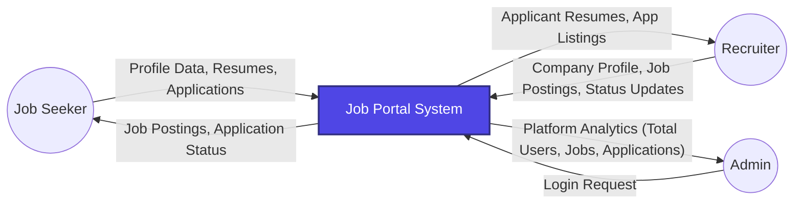
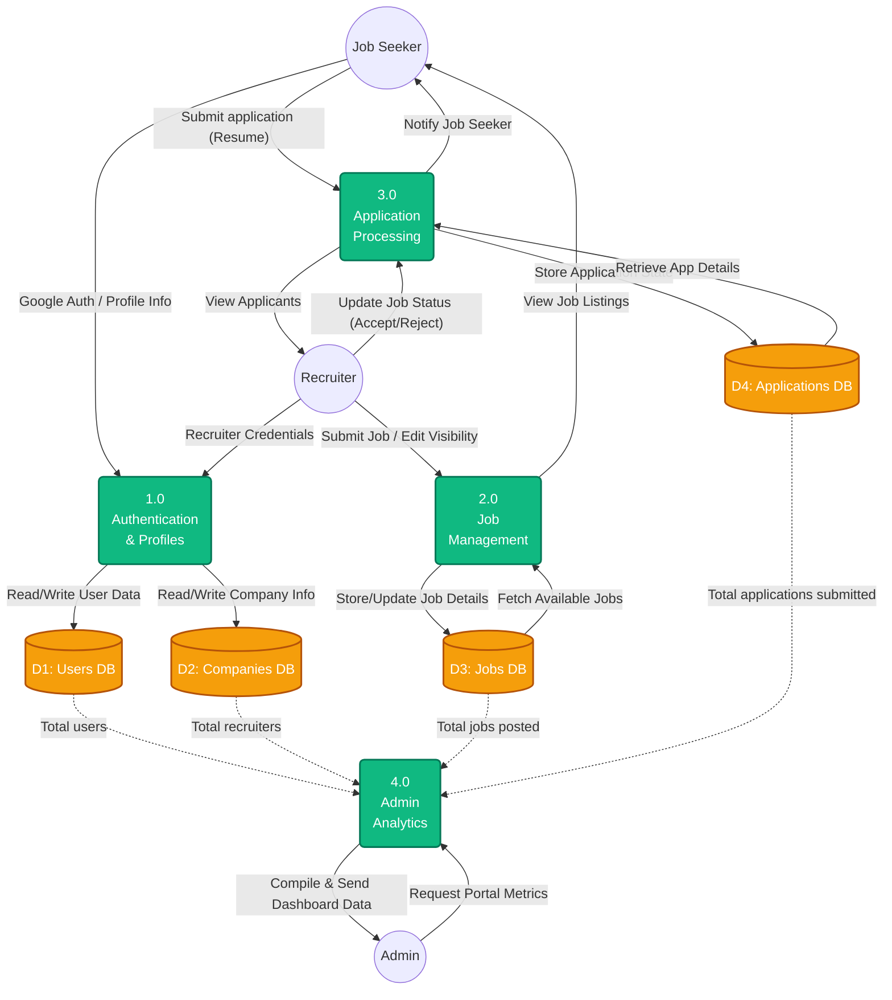

# Job Portal System - Data Flow Diagrams (DFD)

The following diagrams illustrate how data flows between external entities (Job Seekers, Recruiters, Admins), various structural processes, and the database elements within your system.

## Level 0: Context Diagram
The Level 0 DFD provides a high-level overview of the entire system as a single entity and shows the main interactions with external users.

---

## Level 1: Process Diagram
The Level 1 DFD breaks the central system down into its primary sub-processes, exposing how they interact with the distinct databases (Data Stores).

### Diagram Components:
- **Circles (`( )`)**: External Entities (The people directly interacting with the system).
- **Boxes with rounded edges`: Processes (Functions or tasks that the system executes, translating input to output data).
- **Cylinders (`[( )]`)**: Data Stores (MongoDB Collections holding persistent data).
- **Arrows (`-->`)**: Data flow depicting the path and descriptive payload info transferring across nodes.
